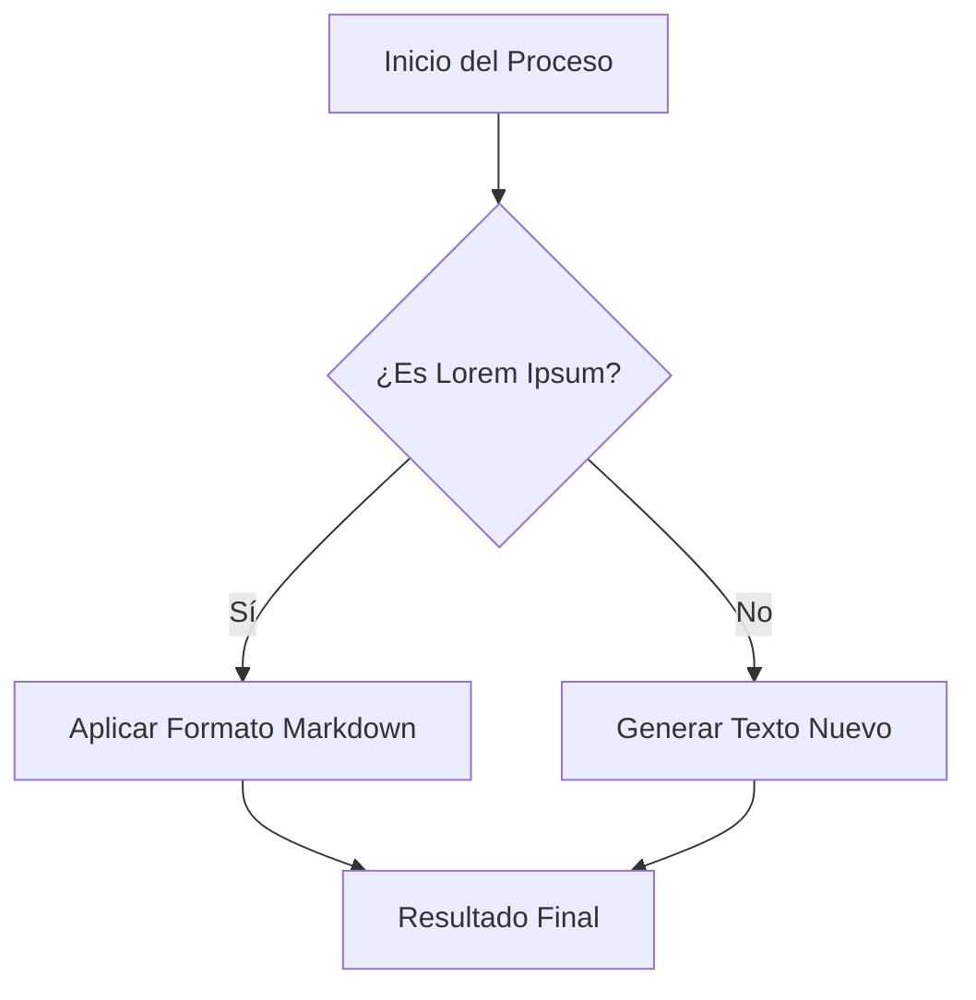

## 1. Tipografía y Énfasis
En esta sección puedes ver cómo resaltar palabras clave dentro de un párrafo estándar.

*Lorem ipsum dolor sit amet*, consectetur adipiscing elit. **Sed do eiusmod tempor** incididunt ut labore et dolore magna aliqua. ***Ut enim ad minim veniam***, quis nostrud exercitation ullamco laboris nisi ut aliquip ex ea commodo consequat.

> **Nota:** El uso de negritas y cursivas ayuda a guiar el ojo del lector a través de bloques de texto densos.

---

## 2. Listas y Organización
Organizar la información es fundamental para la legibilidad.

### Requisitos de Diseño (Lista Desordenada)
* **Elementum:** Mauris vitae ultricies leo integer.
* **Varius:** Sit amet mattis vulputate enim nulla.
* **Facilisis:**
    * Sub-elemento alpha.
    * Sub-elemento beta.

### Pasos a Seguir (Lista Ordenada)
1.  Primis in faucibus orci luctus.
2.  Ultrices posuere cubit curae.
3.  Suspendisse potenti nullam ac.

---

## 3. Tablas de Datos
Las tablas son ideales para comparar atributos de forma rápida.

| Concepto | Estado | Prioridad |
| :--- | :---: | :--- |
| *Duis aute irure* | Activo | Alta |
| *Velit esse cillum* | Pendiente | Media |
| *Excepteur sint* | Finalizado | Baja |

---

## 4. Bloques de Código y Sintaxis
Si necesitas mostrar fragmentos técnicos o instrucciones precisas, el bloque de código es la mejor opción.

```python
def lorem_ipsum(n):
    # Generar secuencia de prueba
    text = "Dolore eu fugiat nulla pariatur."
    return [text for _ in range(n)]
```

## 5. Otros Elementos Visuales
Finalmente, Markdown permite insertar enlaces y tareas pendientes.

* [Visitar documentación oficial](https://www.markdownguide.org)
* [ ] Tarea por completar.
* [x] Tarea ya realizada.

---

## 6. Ejemplo de Diagrama (Mermaid)
Muchos editores de Markdown (como GitHub, Obsidian o Notion) permiten renderizar diagramas usando bloques de código tipo `mermaid`.


